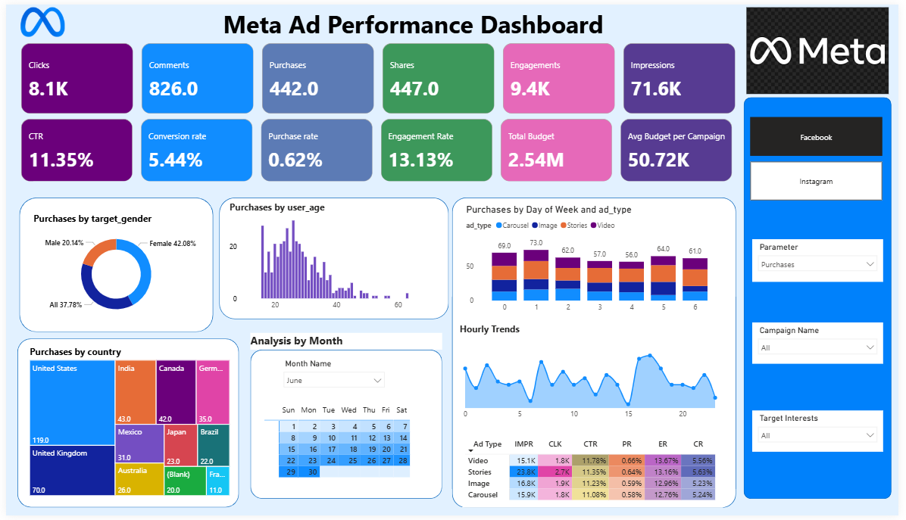

# Meta Ads Performance Analytics using Microsoft Fabric

## Project Overview
This project is an end-to-end marketing analytics solution built using Microsoft Fabric to analyze Meta Ads campaign performance. The project focuses on transforming raw advertising event data into actionable business insights through data engineering, semantic modeling, workflow automation, and interactive Power BI dashboarding.

The solution demonstrates a modern analytics workflow involving:
- Data ingestion and transformation
- Feature engineering
- Lakehouse architecture
- Semantic modeling
- Workflow orchestration
- Interactive Power BI reporting

---

# Live Dashboard

🔗 Power BI Dashboard: https://app.fabric.microsoft.com/links/QexeCza8Xx?ctid=880db91c-d2b8-4752-96bb-ec6f76398bf3&pbi_source=linkShare

---

# Architecture

```text
Raw Meta Ads Data
        ↓
Dataflow / Power Query Transformations
        ↓
Feature Engineering
(Hour, Event_Date)
        ↓
Microsoft Fabric Lakehouse
        ↓
Semantic Model
        ↓
Power BI Dashboard
        ↓
Pipeline Automation & Refresh
```

---

# Business Problem
Marketing teams generate large volumes of advertising data across campaigns, audiences, and time periods. Extracting meaningful insights from raw campaign events can be difficult without proper transformation and analytical modeling.

This project aims to:
- Analyze ad campaign performance
- Identify engagement trends
- Monitor marketing KPIs
- Detect peak engagement periods
- Evaluate campaign effectiveness
- Improve decision-making using data-driven insights

---

# Technologies Used

| Technology | Purpose |
|---|---|
| Microsoft Fabric | End-to-end analytics platform |
| Power BI | Dashboarding & visualization |
| Lakehouse | Centralized analytical storage |
| Power Query / Dataflow Gen2 | Data transformation |
| Semantic Model | Data modeling layer |
| Data Pipeline | Workflow orchestration |
| GitHub | Version control & project documentation |

---

# Data Transformation & Feature Engineering

The raw Meta Ads dataset was transformed using Power Query/Dataflow within Microsoft Fabric.

### Custom Features Created
- **Hour** → Extracted hourly values from timestamp data for hourly engagement analysis
- **Event_Date** → Extracted date values from timestamp data for trend analysis and calendar integration

### Calendar Table
A custom calendar dimension table was created to support:
- Monthly trend analysis
- Quarterly analysis
- Weekday vs weekend analysis
- Time intelligence reporting

---

# Dashboard Analytics

The Power BI dashboard includes:
- Campaign performance KPIs
- Ad spend analysis
- Impressions and engagement metrics
- Hourly activity analysis
- Time-series visualizations
- Trend analysis using calendar dimensions

---

# Workflow Automation

A Microsoft Fabric pipeline was implemented to automate semantic model refresh and streamline the analytics workflow.

---

# Key Insights
- Peak engagement activity was observed during specific hourly intervals.
- Time-based analysis enabled identification of high-performing campaign periods.
- Calendar-based analytics improved monthly and quarterly trend analysis.
- Feature engineering enhanced time-series reporting capabilities.

---

# Repository Structure

```text
meta-ads-performance-analysis/
│
├── screenshots/
│   ├── dashboard-preview.png
│   ├── pipeline-workflow.png
│   └── dataflow-transformations.png
│
├── dataflow/
│   ├── calendar_table_mcode.txt
│   └── transformation-details.md
│
├── powerbi/
│   └── dashboard.pbix
│
└── README.md
```

---

# Dashboard Preview


Recommended screenshots:
- KPI Overview Dashboard
- Hourly Activity Analysis
- Trend Analysis Dashboard
- Pipeline Workflow
- Lakehouse Architecture

---

# Future Improvements
- Real-time streaming analytics
- Advanced KPI calculations
- Predictive campaign analysis
- Azure integration for enterprise scalability
- PySpark-based exploratory data analysis

---

# Learning Outcomes
Through this project, I gained practical experience in:
- Microsoft Fabric ecosystem
- Lakehouse architecture
- Data transformation
- Workflow orchestration
- Marketing analytics
- Power BI dashboard development
- Semantic modeling
- End-to-end analytics pipeline design

---

# Author

**Naaz**  
Aspiring Data Analyst | Microsoft Fabric | Power BI | Data Analytics

GitHub: https://github.com/naaz-719
